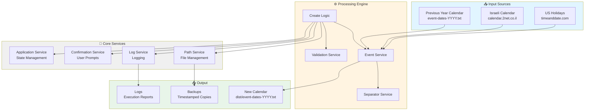

# Event Dates Calendar

A Node.js application to create and manage a personalized calendar TXT file by combining events from multiple sources including Israeli holidays, US holidays, birthdays, anniversaries, and recurring tasks.

Built in March 2021. This JavaScript application scrapes calendar data from online sources, processes events from previous calendar files, and generates a comprehensive daily calendar file with automated task management for an entire year.

## Features

- 🗓️ Fetches Israeli calendar events and holidays from online sources
- 🇺🇸 Imports US holidays and events
- 📅 Manages birthdays, death anniversaries, and marriage anniversaries with age/year calculations
- ⏰ Tracks expiration dates for services, subscriptions, and documents
- ✅ Generates recurring tasks (daily, weekly, weekend patterns)
- 🔄 Processes previous year's calendar data to carry forward events
- 📊 Scans calendar files for unmarked tasks
- 💾 Creates automatic backups of the entire project

## System Architecture



## Getting Started

### Prerequisites

- Node.js (v20.0.0 or higher)
- npm (comes with Node.js)
- Internet connection (for fetching online calendar data)

### Installation

1. Clone the repository:
```bash
git clone https://github.com/orassayag/event-dates-calendar.git
cd event-dates-calendar
```

2. Install dependencies:
```bash
npm install
```

### Configuration

Edit the settings in `src/settings/settings.js`:
- `YEAR`: The year to create the calendar for (e.g., 2025)
- `SOURCE_PATH`: Path to the previous year's source events file
- `CALENDAR_IL_LINK`: Israeli calendar data source URL
- `CALENDAR_US_LINK`: US holidays data source URL
- `DIST_FILE_NAME`: Name for the output file (default: 'event-dates')
- `OUTER_APPLICATION_PATH`: Parent directory path for backups and sources

## Available Scripts

### Create New Calendar
Creates a new calendar file for the target year by combining all event sources:
```bash
npm start
```

### Scan for Unmarked Tasks
Validates and identifies unmarked tasks in calendar files:
```bash
npm run scan
```

### Create Backup
Creates a timestamped backup of the entire project:
```bash
npm run backup
```

### Sandbox Testing
Runs sandbox tests:
```bash
npm run sand
```

## Project Structure

```
event-dates-calendar/
├── src/
│   ├── core/           # Models, enums, and core structures
│   │   ├── enums/      # Enumeration types
│   │   └── models/     # Data models
│   ├── culture/        # Text constants and dictionaries
│   ├── logics/         # Main business logic orchestration
│   ├── scripts/        # Entry point scripts
│   ├── services/       # Service layer (events, paths, logs, etc.)
│   ├── settings/       # Configuration settings
│   ├── tests/          # Test files
│   └── utils/          # Utility functions
├── sources/            # Source calendar files (previous years)
├── dist/               # Generated output files
├── CONTRIBUTING.md     # Contribution guidelines
├── INSTRUCTIONS.md     # Detailed usage instructions
├── LICENSE             # MIT License
└── package.json
```

## How It Works

1. **Configuration**: User sets the target year and source file path in settings
2. **Validation**: Application validates internet connection and URLs
3. **Data Collection**:
   - Reads previous year's calendar file for recurring events
   - Fetches Israeli holidays and events from online source
   - Fetches US holidays from online source
   - Processes birthdays, anniversaries, and expiration dates
4. **Event Processing**:
   - Calculates ages for birthdays
   - Calculates years since for death anniversaries
   - Generates recurring tasks based on patterns
   - Combines all events into daily entries
5. **Output Generation**: Creates organized TXT file with all events for the entire year
6. **Backup**: Optionally creates timestamped project backup

## Event Types

The calendar supports various event types:
- **Birthdays**: With automatic age calculation
- **Death Anniversaries**: With years since calculation
- **Expiration Dates**: For subscriptions, documents, services
- **Israeli Holidays**: Fetched from online calendar
- **US Holidays**: Fetched and included in calendar
- **Recurring Tasks**: Daily, weekly, or monthly patterns
- **Weekend Tasks**: Every weekend or every second weekend
- **Static Events**: Manually defined special dates

## Calendar Format

The generated calendar file contains:
- Daily entries for the entire year
- Clear date headers (e.g., "01/01/2025 - יום ראשון")
- Event descriptions with markers and symbols
- Automatic age/year calculations
- Organized sections for different event types
- Hebrew and English text support

## Development

The project uses:
- **JavaScript ES6+** with modern module syntax
- **ESLint** for code quality
- **jsdom** for HTML parsing and web scraping
- **fs-extra** for enhanced file operations
- **is-reachable** for URL validation

## Contributing

Contributions to this project are [released](https://help.github.com/articles/github-terms-of-service/#6-contributions-under-repository-license) to the public under the [project's open source license](LICENSE).

Everyone is welcome to contribute. Contributing doesn't just mean submitting pull requests—there are many different ways to get involved, including answering questions, reporting issues, improving documentation, or suggesting new features.

Please read [CONTRIBUTING.md](CONTRIBUTING.md) for details on the code of conduct and the process for submitting pull requests.

For detailed usage instructions, see [INSTRUCTIONS.md](INSTRUCTIONS.md).

## Versioning

We use [SemVer](http://semver.org) for versioning. For the versions available, see the [tags on this repository](https://github.com/orassayag/event-dates-calendar/tags).

## Author

* **Or Assayag** - *Initial work* - [orassayag](https://github.com/orassayag)
* Or Assayag <orassayag@gmail.com>
* GitHub: https://github.com/orassayag
* StackOverflow: https://stackoverflow.com/users/4442606/or-assayag?tab=profile
* LinkedIn: https://linkedin.com/in/orassayag

## License

This application has an MIT license - see the [LICENSE](LICENSE) file for details.
